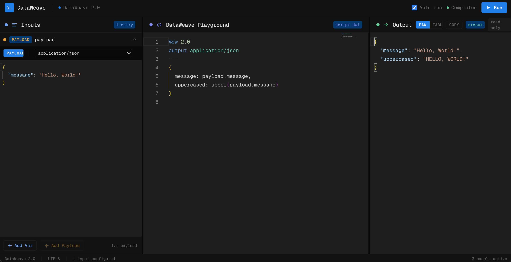

# DataWeave-Py

A DataWeave data transformation runtime with a Rust-native engine package and a Python bridge, providing powerful data transformation capabilities without requiring the JVM.

Install from PyPI:

```bash
uv add dataweave-py
```

or

```bash
pip install dataweave-py
```

Install the terminal command with uv:

```bash
uv tool install dataweave-py
dw run '%dw 2.0\noutput application/json\n---\n{message: upper(payload.name)}' --payload '{"name":"dw"}'
```

## DataWeave Playground


For the best DataWeave Playground a without payload size limits DataWeave Playground, visit: [https://dataweavelang.org](https://dataweavelang.org)


Optional extras:

```bash
# pandas helpers (DataFrame/Series input normalization)
pip install "dataweave-py[pandas]"

# pydantic helpers
pip install "dataweave-py[pydantic]"

# everything
pip install "dataweave-py[full]"
```

## Overview

DataWeave-Py (`dwpy`) is a Python-facing interpreter for the DataWeave language, originally developed by MuleSoft for data transformation in the Mule runtime. The runtime is migrating to a Rust core while preserving the existing Python API, enabling:

- **Data transformation**: Convert between JSON, XML, CSV and other formats
- **Functional programming**: Leverage map, filter, reduce, and other functional operators
- **Pattern matching**: Use powerful match expressions with guards and bindings
- **Safe navigation**: Handle null values gracefully with null-safe operators
- **Rich built-ins**: Access 100+ built-in functions for strings, numbers, dates, arrays, and objects

## Requirements

- Python 3.10 or higher
- Rust stable toolchain with `cargo`
- Node.js, npm, `wasm-pack`, and the `wasm32-unknown-unknown` target for the WASM backend
- Dependencies managed via [uv](https://github.com/astral-sh/uv) (recommended) or pip

## Rust Engine And Python Bridge

The default runtime path is the Rust engine exposed through the Python package as
`dwpy._dwpy_rust`. The legacy Python interpreter is still available as an
explicit fallback backend.

Build and install the Rust-backed Python bridge into the local virtual
environment:

```bash
uv venv --python 3.12
source .venv/bin/activate
UV_CACHE_DIR=.uv-cache uv run maturin develop --release
```

Run the Python-packaged CLI from the current checkout:

```bash
uv tool install .
dw run '%dw 2.0\noutput application/python\n---\n{message: upper(payload.name)}' --payload '{"name":"dw"}'
```

Or run it without installing globally:

```bash
uvx --from . dw run '%dw 2.0\noutput application/json\n---\npayload' --payload '{"name":"dw"}'
```

Run the standalone native Rust binary:

```bash
cargo run -p dwpy-cli -- run '%dw 2.0\noutput application/json\n---\npayload' --payload '{"name":"dw"}'
```

## Homebrew

The Rust-native CLI is distributed through a separate Homebrew tap repository:
`estebanwasinger/homebrew-tap`.

The intended user flow is:

```bash
brew tap estebanwasinger/homebrew-tap
brew install dw-cli
dw run "1 to 1"
```

This repository includes:

- `scripts/build_dw_cli_source_archive.sh` to build the deterministic source
  archive used by the formula
- `.github/workflows/release-dw-cli-source.yml` to upload that archive to a
  GitHub release

The release split is intentional:

- `dataweave-py` releases provide the source archive consumed by the formula
- `homebrew-tap` releases provide the bottled Homebrew binaries

Run the Rust backend from Python:

```python
from dwpy import DataWeaveRuntime

runtime = DataWeaveRuntime(backend="rust")
result = runtime.execute(
    "%dw 2.0\noutput application/json\n---\n{message: upper(payload.message)}",
    {"message": "hello from rust"},
)
print(result)
```

Backend selection:

- `DataWeaveRuntime()` or `backend="auto"` uses the Rust bridge first and falls
  back to the legacy Python backend only for explicitly unsupported migration
  gaps.
- `DataWeaveRuntime(backend="rust")` runs strict Rust mode and fails instead of
  falling back.
- `DataWeaveRuntime(backend="python")` uses the legacy Python interpreter.
- `DataWeaveRuntime(backend="wasm")` runs the Rust evaluator compiled to WASM
  through the Node.js bridge.
- `DWPY_BACKEND=rust` forces strict Rust mode for process-wide test runs.

Build a distributable wheel with the Rust extension:

```bash
UV_CACHE_DIR=.uv-cache uv run maturin build --release
```

Run the Rust workspace tests:

```bash
cargo test --workspace
```

Run the Python suite against the Rust backend:

```bash
DWPY_BACKEND=rust UV_CACHE_DIR=.uv-cache uv run --extra dev pytest
```

Run the default Python package path, which exercises the Python bridge:

```bash
UV_CACHE_DIR=.uv-cache uv run --extra dev pytest
```

Run the Python suite in all three runtime modes—legacy Python, native Rust,
and Rust compiled to WASM:

```bash
bash scripts/test_backends.sh
```

The script rebuilds the WASM package before its test pass and preserves the
individual pytest results. It accepts normal pytest arguments for focused
runs, for example:

```bash
bash scripts/test_backends.sh tests/test_runtime_basic.py -k dynamic
```

## Quick Start

### Basic Usage

```python
from dwpy import DataWeaveRuntime

# Create a runtime instance
runtime = DataWeaveRuntime()

# Define a DataWeave script
script = """%dw 2.0
output application/json
---
{
  message: "Hello, " ++ upper(payload.name),
  timestamp: now()
}
"""

# Execute with a payload
payload = {"name": "world"}
result = runtime.execute(script, payload)

print(result)
# Output: {'message': 'Hello, WORLD', 'timestamp': '2025-11-03T...Z'}
```

### Data Transformation Example

```python
from dwpy import DataWeaveRuntime

runtime = DataWeaveRuntime()

# Transform and enrich order data
script = """%dw 2.0
output application/json
---
{
  orderId: payload.id,
  status: upper(payload.status default "pending"),
  total: payload.items reduce ((item, acc = 0) -> 
    acc + (item.price * (item.quantity default 1))
  ),
  itemCount: sizeOf(payload.items)
}
"""

payload = {
    "id": "ORD-123",
    "status": "confirmed",
    "items": [
        {"price": 29.99, "quantity": 2},
        {"price": 15.50, "quantity": 1}
    ]
}

result = runtime.execute(script, payload)
print(result)
# Output: {'orderId': 'ORD-123', 'status': 'CONFIRMED', 'total': 75.48, 'itemCount': 2}
```

### Using Variables

```python
from dwpy import DataWeaveRuntime

runtime = DataWeaveRuntime()

script = """%dw 2.0
output application/json
var requestTime = vars.requestTime default now()
---
{
  user: payload.userId,
  processedAt: requestTime
}
"""

payload = {"userId": "U-456"}
vars = {"requestTime": "2024-05-05T12:00:00Z"}

result = runtime.execute(script, payload, vars=vars)
```

### Pattern Matching

```python
from dwpy import DataWeaveRuntime

runtime = DataWeaveRuntime()

script = """%dw 2.0
output application/json
---
{
  category: payload.price match {
    case var p when p > 100 -> "premium",
    case var p when p > 50 -> "standard",
    else -> "budget"
  }
}
"""

result = runtime.execute(script, {"price": 75})
# Output: {'category': 'standard'}
```

### String Interpolation

```python
from dwpy import DataWeaveRuntime

runtime = DataWeaveRuntime()

# Simple interpolation
script = """%dw 2.0
output application/json
---
{
  greeting: "Hello $(payload.name)!",
  total: "Total: $(payload.price * payload.quantity)",
  status: "Order $(payload.orderId) is $(upper(payload.status))"
}
"""

payload = {
    "name": "Alice",
    "price": 10.5,
    "quantity": 3,
    "orderId": "ORD-123",
    "status": "confirmed"
}

result = runtime.execute(script, payload)
# Output: {
#   'greeting': 'Hello Alice!',
#   'total': 'Total: 31.5',
#   'status': 'Order ORD-123 is CONFIRMED'
# }
```

String interpolation allows you to embed expressions directly within strings using the `$(expression)` syntax. The expression can be:
- Property access: `$(payload.name)`
- Nested properties: `$(payload.user.email)`
- Expressions: `$(payload.price * 1.1)`
- Function calls: `$(upper(payload.status))`
- Any valid DataWeave expression

### Output Formats

The runtime supports these output directives:
- `application/python` (native Python objects)
- `application/json`
- `application/csv`
- `application/xml`
- `text/plain`
- `text/markdown`

Format-specific notes:
- `output text/plain` only works when the final script result is a string.
- `output text/markdown` expects a tabular value (`list` or `dict`) and renders a Markdown table.
- `output text/markdown header=false` is rejected because Markdown table rendering requires headers.
- `payload_format="text/markdown"` parses Markdown pipe tables into structured rows (`Array<Object>` by default, or `Array<Array<String>>` with `payload_format_options={"header": False}`).

## Supported Features

DataWeave-Py currently supports a wide range of DataWeave language features:

### Core Language Features
- ✅ Header directives (`%dw 2.0`, `output`, `var`, `import`)
- ✅ Payload and variable access
- ✅ Object and array literals
- ✅ Field selectors (`.field`, `?.field`, `[index]`)
- ✅ Comments (line `//` and block `/* */`)
- ✅ Default values (`payload.field default "fallback"`)
- ✅ String interpolation (`"Hello $(payload.name)"`)

### Operators
- ✅ Concatenation (`++`)
- ✅ Difference (`--`)
- ✅ Arithmetic (`+`, `-`, `*`, `/`)
- ✅ Comparison (`==`, `!=`, `>`, `<`, `>=`, `<=`)
- ✅ Logical (`and`, `or`, `not`)
- ✅ Range (`to`)

### Control Flow
- ✅ Conditional expressions (`if-else`)
- ✅ Pattern matching (`match-case`)
- ✅ Match guards (`case var x when condition`)

### Collection Operations
- ✅ `map` - Transform elements
- ✅ `filter` - Select elements
- ✅ `reduce` - Aggregate values
- ✅ `flatMap` - Map and flatten
- ✅ `distinctBy` - Remove duplicates
- ✅ `groupBy` - Group by criteria
- ✅ `orderBy` - Sort elements

### Built-in Functions

#### String Functions
`upper`, `lower`, `trim`, `contains`, `startsWith`, `endsWith`, `isBlank`, `splitBy`, `joinBy`, `find`, `match`, `matches`

#### Numeric Functions
`abs`, `ceil`, `floor`, `round`, `pow`, `mod`, `sum`, `avg`, `max`, `min`, `random`, `randomInt`, `isDecimal`, `isInteger`, `isEven`, `isOdd`

#### Array/Object Functions
`sizeOf`, `isEmpty`, `flatten`, `indexOf`, `lastIndexOf`, `distinctBy`, `filterObject`, `keysOf`, `valuesOf`, `entriesOf`, `pluck`, `maxBy`, `minBy`

#### Date Functions
`now`, `isLeapYear`, `daysBetween`

#### Utility Functions
`log`, `logInfo`, `logDebug`, `logWarn`, `logError`

## Running Tests

The project includes comprehensive test coverage:

```bash
# Run all tests
pytest

# Run specific test file
pytest tests/test_runtime_basic.py

# Run with verbose output
pytest -v

# Run with coverage
pytest --cov=dwpy
```

## Browser WASM (Pyodide)

The project includes a browser-worker runtime for WASM execution with Pyodide and wheel-based loading.

- Worker bootstrap: `web/pyodide-worker.mjs`
- Python entrypoint: `dwpy.wasm_entry.run_dataweave(...)`
- Full instructions: [`docs/WASM_PYODIDE.md`](docs/WASM_PYODIDE.md)

## Language Server (LSP)

The project now includes a stdio Language Server for DataWeave:

- Command: `dwpy-lsp`
- Module: `dwpy.lsp.server`
- Engine shared with Monaco + WASM completion bridge: `dwpy.lsp.engine`

### Install

Install the LSP extra:

```bash
uv pip install "dataweave-py[lsp]"
```

### Sidecar context files

For structure-aware `payload`/`vars` completion in `.dwl` files, place these JSON files next to the script:

- `<file>.payload.json`
- `<file>.vars.json`

Example for `transform.dwl`:

- `transform.dwl.payload.json`
- `transform.dwl.vars.json`

If sidecars are missing or invalid, the server falls back to script-only inference.

### VS Code client (example)

```json
{
  "languageserver": {
    "dataweave-py": {
      "command": "dwpy-lsp",
      "filetypes": ["dataweave", "dwl"]
    }
  }
}
```

### Neovim client (example)

```lua
require("lspconfig").dwpy_lsp.setup({
  cmd = { "dwpy-lsp" },
  filetypes = { "dataweave", "dwl" },
})
```

## Project Structure

```
dataweave-py/
├── crates/                    # Rust workspace
│   ├── dwpy-core/             # Core Rust value model and engine foundation
│   ├── dwpy-python/           # PyO3 extension exposed as dwpy._dwpy_rust
│   └── dwpy-wasm/             # WASM wrapper foundation
├── dwpy/                      # Main Python package
│   ├── __init__.py           # Package exports
│   ├── parser.py             # DataWeave parser
│   ├── runtime.py            # Runtime backend facade
│   ├── _python_runtime.py    # Legacy Python interpreter backend
│   └── builtins.py           # Built-in functions
├── tests/                     # Test suite
│   ├── test_runtime_basic.py # Core functionality tests
│   ├── test_builtins.py      # Built-in function tests
│   └── fixtures/             # Test data and fixtures
├── runtime-2.11.0-20250825/  # Original JVM runtime reference
├── docs/                      # Documentation
├── pyproject.toml            # Project configuration
└── README.md                 # This file
```

## Development

### Setting Up Development Environment

```bash
# Create virtual environment
uv venv --python 3.12
source .venv/bin/activate

# Install Python development dependencies
UV_CACHE_DIR=.uv-cache uv sync --extra dev

# Build and install the Rust-backed Python bridge in editable mode
UV_CACHE_DIR=.uv-cache uv run maturin develop --release
```

### Running the Test Suite

```bash
# Run all tests
UV_CACHE_DIR=.uv-cache uv run --extra dev pytest

# Force strict Rust backend
DWPY_BACKEND=rust UV_CACHE_DIR=.uv-cache uv run --extra dev pytest

# Run Rust workspace tests
cargo test --workspace
```

### Code Style

The project follows standard Python conventions:
- PEP 8 style guide
- Type hints where appropriate
- Comprehensive docstrings
- Two-space indentation for consistency with Scala codebase

## Comparison with JVM Runtime

DataWeave-Py aims to provide feature parity with the official JVM-based DataWeave runtime. Key differences:

| Feature | JVM Runtime | DataWeave-Py |
|---------|-------------|--------------|
| Language | Scala | Rust core with Python bridge |
| Performance | High (compiled/JIT) | Native Rust engine through PyO3 |
| Startup Time | Slower (JVM warmup) | Fast native extension loading |
| Memory Usage | Higher (JVM overhead) | Lower native runtime footprint |
| Integration | Java/Mule apps | Python apps, Rust crate, future WASM wrapper |
| Module System | Full support | Rust-native support for the current suite |
| Type System | Static typing | Rust-backed inference plus Python API helpers |

## Roadmap

### Current Status (v0.1.0)
- ✅ Core language parser
- ✅ Expression evaluation
- ✅ 60+ built-in functions
- ✅ Pattern matching
- ✅ Collection operators

### Planned Features
- 🔄 Full module system support
- 🔄 Import statements
- 🔄 Custom function definitions
- 🔄 XML/CSV format support
- 🔄 Streaming for large datasets
- 🔄 Type validation
- 🔄 Performance optimizations

## Contributing

Contributions are welcome! Please:

1. Fork the repository
2. Create a feature branch (`git checkout -b feature/amazing-feature`)
3. Write tests for your changes
4. Ensure all tests pass (`pytest`)
5. Commit your changes (`git commit -m 'feat: add amazing feature'`)
6. Push to the branch (`git push origin feature/amazing-feature`)
7. Open a Pull Request

## License

See the original DataWeave runtime license terms. This project is a reference implementation for educational and development purposes.

## Resources

- [DataWeave Documentation](https://docs.mulesoft.com/dataweave/)
- [DataWeave Tutorial](https://developer.mulesoft.com/tutorials-and-howtos/dataweave/)
- [DataWeave Playground](https://dataweave.mulesoft.com/learn/playground)

## Support

For questions, issues, or contributions:
- Open an issue on GitHub
- Check existing documentation in the `docs/` directory
- Review test cases in `tests/` for usage examples

---

**Note**: This is an independent Python implementation and is not officially supported by MuleSoft. For production use cases requiring full DataWeave compatibility, please use the official JVM-based runtime.
